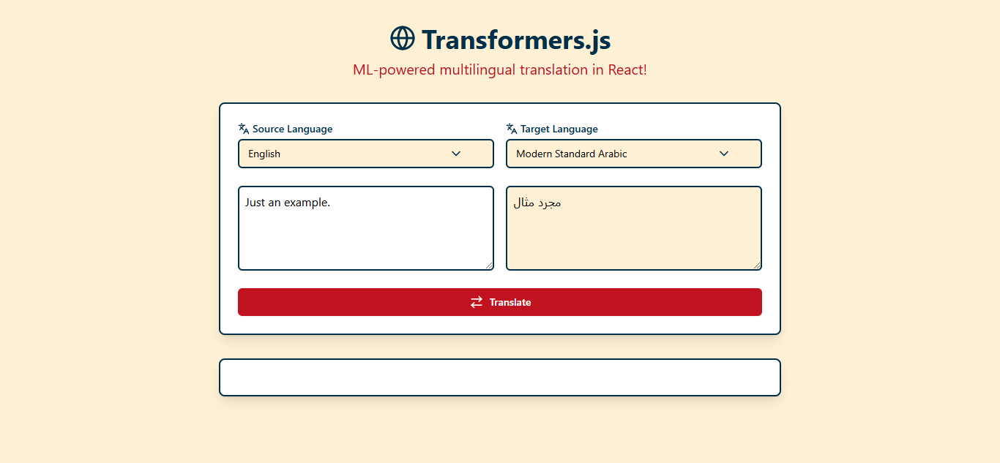

# Multilingual Translation with Transformers.js

A real-time multilingual translation web application powered by Hugging Face's Transformers.js and React. This project brings machine learning capabilities directly to your browser without requiring a backend server.



## 🌟 Features

- **Real-time Translation**: Instant translation as you type
- **200+ Languages Support**: Comprehensive coverage of world languages
- **Browser-based ML**: Runs entirely in the browser using WebAssembly
- **Streaming Output**: Progressive translation display
- **Responsive Design**: Works seamlessly on desktop and mobile devices
- **No Backend Required**: Complete client-side implementation

## 🤖 Machine Learning Model

This project uses the `Xenova/nllb-200-distilled-600M` model, which is:

- A distilled version of Meta's No Language Left Behind (NLLB) model
- Capable of translating between 200+ languages
- Optimized for browser-based execution
- Provides high-quality translations with reduced model size

## 🛠️ Technical Stack

- **Frontend**: React
- **ML Framework**: Transformers.js
- **UI Components**: Lucide React for icons
- **Styling**: Tailwind CSS
- **Build Tool**: Vite
- **Worker**: Web Workers for non-blocking ML operations

## 🚀 Getting Started

1- Clone the repository:

```bash
git clone https://github.com/KhaledSaeed18/multilingual-translation-Transformers.js.git
```

2- Install dependencies:

```bash
npm install
```

3- Start the development server:

```bash
npm run dev
```

4- Open your browser and navigate to `http://localhost:5173`

## 💡 How It Works

1. The application loads the ML model in a Web Worker to prevent UI blocking
2. First-time usage downloads and caches the model (~300MB)
3. Subsequent uses retrieve the model from cache
4. Translations are processed entirely client-side
5. Results stream back to the UI in real-time

## 🌍 Supported Languages

The application supports 200+ languages including:

- Major languages (English, Spanish, French, etc.)
- Regional dialects
- Low-resource languages
- Various script variations (Latin, Cyrillic, etc.)
